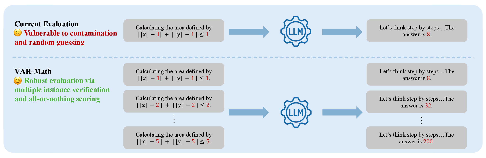
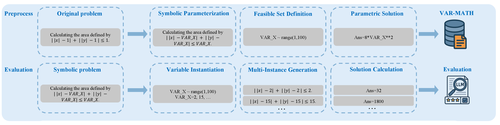

# 🔥 VAR-MATH: Probing True Mathematical Reasoning in Large Language Models via Symbolic Multi-Instance Benchmarks
> **Reassessing RL Enhancement Under Rigorous Testing**

[](LICENSE)
[](https://www.python.org/downloads/)
[](https://arxiv.org/abs/2507.12885)

<div align="center">
  
  <br><em>Multi-Instance Verification Framework</em>
</div>

## Updated
[2025.10.12] Add VAR-AIME25 and bootstrap methods.


🔎 Our findings reveal two paradigm-shifting insights about mathematical reasoning in LLMs:

1. **The RL Enhancement Illusion**  
   Our research fundamentally challenges the purported reasoning improvements from RL training: When evaluated through our variabilization framework, these models exhibit catastrophic performance collapses once stripped of benchmark-specific patterns, revealing that their perceived capabilities stem not from enhanced reasoning, but from specialized adaptation to fixed problem sets through shallow heuristics.

2. **The Contamination-Reasoning Double Bind**  
   We expose a critical dual pathology in popular models like Qwen base model that enables this illusion: First, severe data contamination artificially inflates benchmark performance while masking fundamental reasoning deficits; second, an inherent instability in symbolic processing prevents consistent generalization, creating models that can solve specific instantiations but fail to recognize equivalent mathematical structures across variations - what we term "surface competence without conceptual understanding."

Together, these findings reveal that current evaluation practices primarily measure benchmark-specific optimization rather than genuine mathematical reasoning—highlighting the need for a fundamental rethink in how we assess and develop mathematical AI systems.
To move forward, we must go beyond static benchmarks and account for both data contamination and symbolic inconsistency in evaluation. VAR-MATH offers a broadly applicable methodology—not limited to AMC23 or AIME24, but extendable to domains like program synthesis, formal logic, and decision-making.

Let’s build evaluations that reward structural generalization and behavioral consistency—not just memorized answers！


### Data Construction & Evaluation Pipeline
<div align="center">
  
  <br><em> The process consists of two stages: preprocessing and evaluation. During preprocessing, original math problems are symbolically abstracted by replacing fixed constants with variables, defining feasible sampling ranges, and expressing answers as parametric functions. These symbolic problem templates are stored in the VAR-MATH benchmark.In the evaluation stage, symbolic problems are instantiated with sampled values from the defined variable ranges, producing multiple concrete versions of the same underlying structure. Each instantiation is solved, and models must produce all correct answers to be considered successful. This strategy enforces reasoning consistency and mitigates contamination and evaluation instability.</em>
</div>

## ⚙️ Setup
We provide the environment for evaluation, tested on Debian 6.1.106-3 with A6000 GPUs:
```bash
conda create -n VAR-MATH python==3.9.0
conda activate VAR-MATH
cd latex2sympy
pip install -e . 
cd ..
pip install -r requirements.txt
```

## ▶️ Run Evaluation

### Generate the VAR-Math data
```bash
python csv2json.py
```

We provide the original csv file for editing the questions.
We also provide the csv with suffix "_debug" for users to check the new generated questions.

### Evaluate
```bash
sh eval_local_7b.sh # for 7B-parameter models
sh eval_local_32b.sh # for 32B-parameter models
sh eval_api.sh # YOU SHOULD FILL THE API KEY AND THE BASE URL.
```

### Collect the results
```bash
python VAR_score_pass_1/score_analysis.py # for Large-scale models
python VAR_score_pass_16/score_analysis.py # for 7B- and 32B-parameter models
```

## Acknowledgments

We extend our sincere gratitude to:
- **AMC/AIME** for open-sourcing their mathematical problem collections
- The developers of evaluation frameworks:
  - [math-evaluation-harness](https://github.com/ZubinGou/math-evaluation-harness)
  - [Qwen2.5-Math](https://github.com/QwenLM/Qwen2.5-Math)
- The broader open-source community for making models and tools publicly available

## Citations

```bibtex
@article{varmath2025,
  title={VAR-MATH: Probing True Mathematical Reasoning in Large Language Models via Symbolic Multi-Instance Benchmarks},
  author={Yao, Jian and Cheng, Ran and Tan, Kay Chen},
  journal={arXiv preprint arXiv:2507.12885},
  year={2025}
}
```
